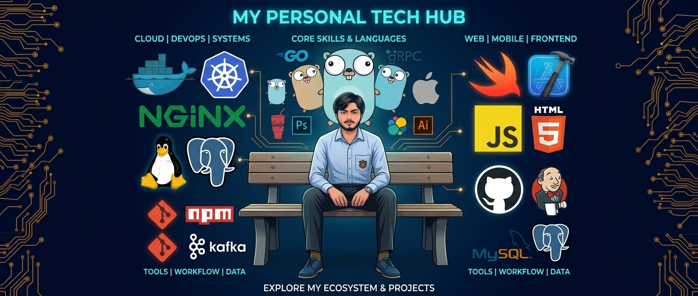

  

<h1 align="center">Khalilullah Sadique</h1>

  
  
  
  

I am a full-stack engineer focused on frontend/backend systems, concurrency, and performance. Most of my time is spent writing Go, building web and mobile apps, and figuring out how to make services run faster and scale without breaking.

Right now, I am running engineering at **Devistic** and building native mobile apps and concurrent frontend/backends.

---

## 🛠️ Tech Stack

| Category | Tools & Technologies |
| :--- | :--- |
| **Backend & Systems** | Golang, Node.js,|
| **Frontend & Mobile** | React, React Native, TypeScript, JavaScript (ES6+) |

---

## 🚀 Projects & Ventures

### Devistic
Co-founder. Architecting MVP products, setting up automated deployment pipelines, and managing infrastructure for client and internal applications along side Senior Engineer co-founders.

### LabSync (Lab Test Generator)
An offline-first desktop app built with Python and PySide6. Engineered for medical labs to manage patient data securely and generate structured PDF reports without an active internet connection.

---

## 📈 GitHub Analytics

  

  

---

## 🔗 Links & Contact

- **Portfolio:** https://khalilullahsadique.vercel.app/
- **LinkedIn:** [khalilullah-sadique](https://www.linkedin.com/in/khalilullah-sadique-17592825a/)
- **Instagram:** [@khalilullahsadique](https://www.instagram.com/khalilullahsadique/)
- **Discord:** [profile](https://discord.com/users/1195293510425911308)
- **Threads:** [@khalilullahsadique](https://www.threads.com/@khalilullahsadique)
- **Email:** [khalilullahsadique1334@gmail.com](mailto:khalilullahsadique1334@gmail.com)
